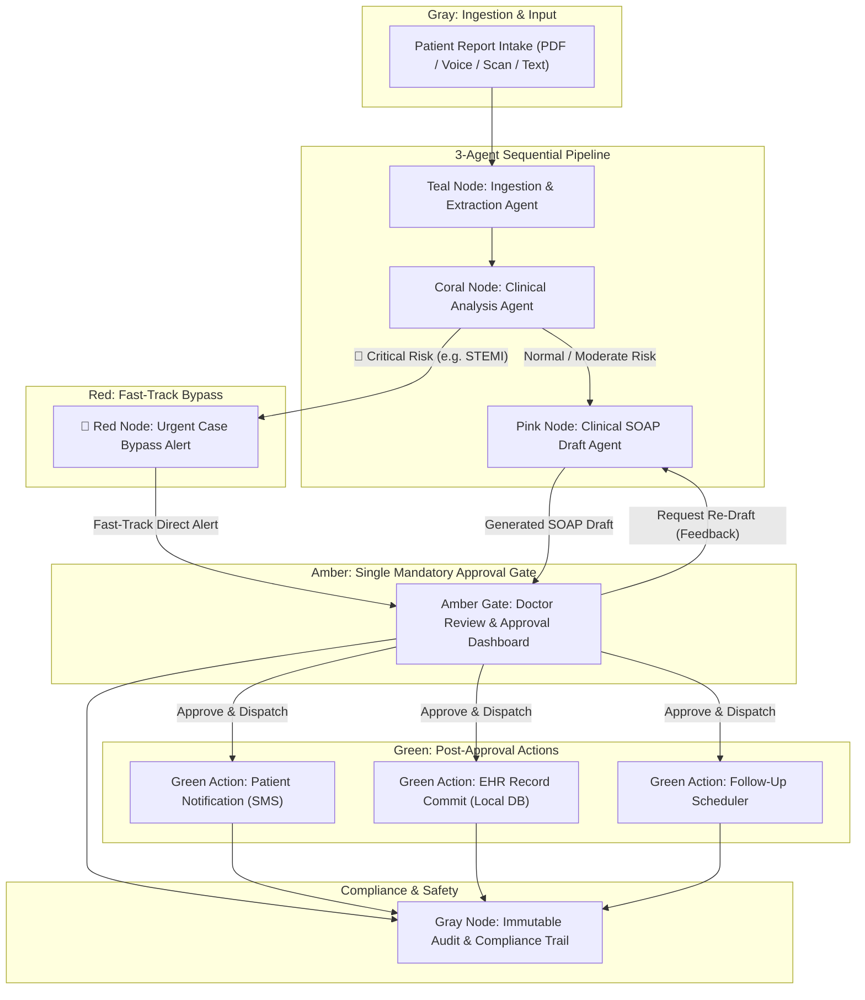

# 📐 System Architecture: Autonomous Clinical AI Pipeline

This document outlines the architectural design, agentic orchestration, and fail-safe mechanisms of the **Autonomous Clinical AI Agentic Pipeline** — a human-in-the-loop healthcare workflow designed for hackathons and production clinical triage.

---

## 🗺️ High-Level System Workflow Diagram



---

## 🎨 Color-Coded Architecture Key

| Stage | Color | Hex Code | Purpose |
| :--- | :--- | :--- | :--- |
| **Data & Audit** | **Gray** | `#64748B` | Unstructured patient data intake & compliance audit trail. |
| **Ingestion Agent** | **Teal** | `#0D9488` | Agentic OCR, PDF parsing, and FHIR field extraction. |
| **Analysis Agent** | **Coral** | `#F97316` | Computed risk score (0-100), abnormality detection & baselines. |
| **Urgent Bypass** | **Red** | `#EF4444` | Fast-track alert for critical life-threatening emergencies. |
| **Draft Agent** | **Pink** | `#EC4899` | SOAP clinical note synthesis, ICD-10 coding & treatment plans. |
| **Human Approval Gate** | **Amber** | `#F59E0B` | Single mandatory checkpoint — no action fires without doctor approval. |
| **Post-Approval** | **Green** | `#10B981` | Dispatch actions: EHR commit, SMS notification, follow-up booking. |

---

## 🔄 End-to-End Data Pipeline Flow

```
+-------------------------------------------------------------------------------+
| 1. INGESTION & EXTRACTION (Teal)                                              |
|    - Raw PDF / Scan / Voice Payload -> Multimodal OCR & Field Structuring     |
|    - Extracts: Name, Age, Gender, MRN, Vitals, Symptoms, Meds, Allergies      |
+-------------------------------------------------------------------------------+
                                       |
                                       v
+-------------------------------------------------------------------------------+
| 2. CLINICAL RISK ANALYSIS (Coral)                                             |
|    - Evaluates Risk Score (0-100) & Flags Abnormalities                       |
|    - Compares current vitals against historical patient baseline               |
+-------------------------------------------------------------------------------+
                                       |
                     +-----------------+-----------------+
                     |                                   |
           (Urgency == Critical)                (Urgency == Moderate/Low)
                     |                                   |
                     v                                   v
+----------------------------------------+ +------------------------------------+
| 🚨 URGENT BYPASS ALERT (Red)           | | 3. SOAP NOTE & DRAFT AGENT (Pink)   |
| - Fast-tracks direct doctor alert     | | - Synthesizes Clinical SOAP Note |
| - AI drafting never delays emergency   | | - Proposes ICD-10 & Treatment Plan|
+----------------------------------------+ +------------------------------------+
                     |                                   |
                     +-----------------+-----------------+
                                       |
                                       v
+-------------------------------------------------------------------------------+
| 4. DOCTOR REVIEW & APPROVAL GATE (Amber - Single Gatekeeper)                  |
|    - Physician reviews, edits orders, or requests AI re-draft                 |
|    - Single mandatory gate everything must pass through                        |
+-------------------------------------------------------------------------------+
                                       |
                               (Approved & Dispatched)
                                       |
                                       v
+-------------------------------------------------------------------------------+
| 5. POST-APPROVAL DISPATCH (Green)                                             |
|    - Action 1: Patient SMS Notification Ticket                                |
|    - Action 2: EHR Local Database Commit Record                               |
|    - Action 3: Appointment Scheduling Ticket                                  |
|    - Logging: Immutable Compliance Audit Trail Record                         |
+-------------------------------------------------------------------------------+
```

---

## 🛡️ Key Architectural Principles

1. **Human-in-the-Loop Gatekeeper**:
   - AI **never** takes direct clinical action (sending prescriptions or updating EHR) autonomously. Everything passes through the Amber Physician Approval Gate.
2. **Urgent Fast-Track Bypass**:
   - If an acute emergency (e.g. ST-elevation STEMI or Anaphylaxis) is detected by the Analysis Agent, a red alert fast-tracks directly to the physician dashboard — AI drafting never delays a critical life-saving alert.
3. **Interactive AI Re-Drafting Loop**:
   - Doctors can reject drafts or request revisions with specific feedback (e.g., *"Add beta-blocker"*), sending the payload back to the Draft Agent (`REVISION #2`) for instant re-synthesis.
4. **Immutable Audit & Compliance Log**:
   - Every action, timestamp, risk score, physician edit, and dispatch event is logged in a compliance audit trail with JSON export capabilities.
