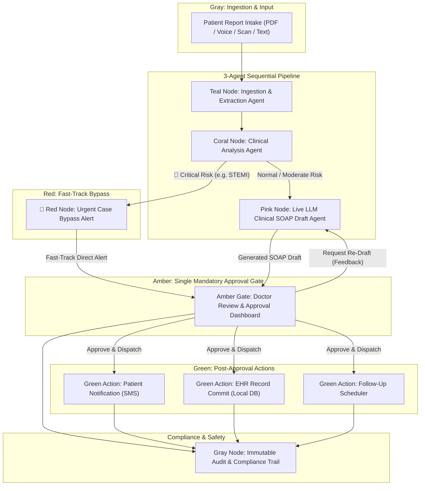
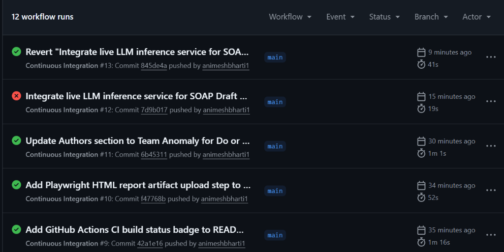
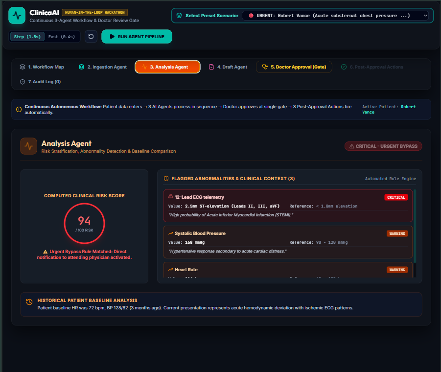
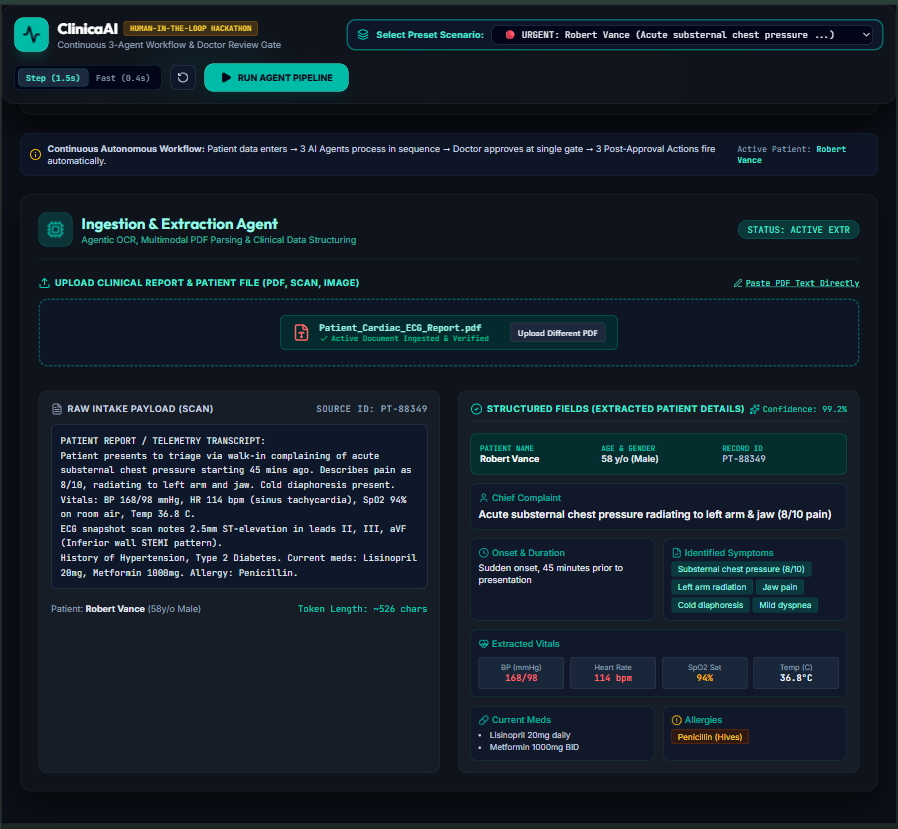
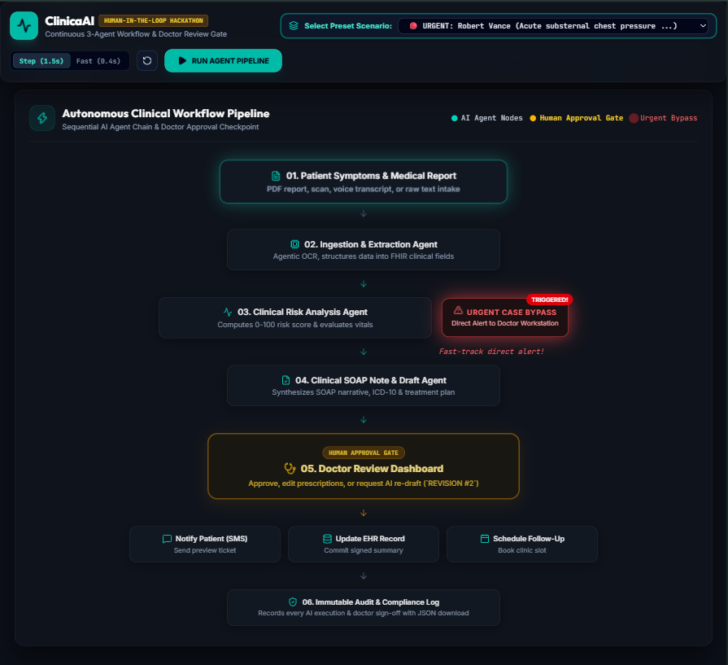
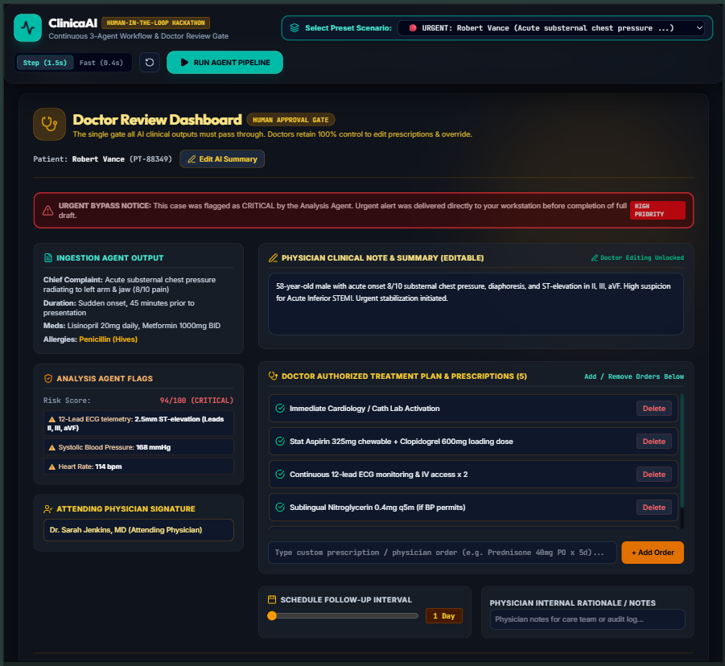

# 🏥 Autonomous Clinical AI Pipeline

> **An Agentic Healthcare Triage System with Real-Time Risk Analysis, Urgent Case Bypass, and Human-in-the-Loop Physician Approval.**

[](https://github.com/animeshbharti1/clinical-ai-agentic-pipeline/actions/workflows/ci.yml)
[](https://clinical-ai-agentic-pipeline.vercel.app/)
[](LICENSE)
[](https://reactjs.org/)
[](https://www.typescriptlang.org/)
[](https://vitejs.dev/)
[](https://tailwindcss.com/)

🌐 **Live Production Deployment**: [https://clinical-ai-agentic-pipeline.vercel.app/](https://clinical-ai-agentic-pipeline.vercel.app/)

---

## 🎯 Problem Statement

Modern healthcare environments face mounting challenges that lead to physician burnout and delayed emergency care:
* **Overwhelming Administrative Burden**: Doctors spend up to 40% of their time manually transcribing patient records, computing risk scores, drafting SOAP notes, and entering EHR data.
* **Triage Bottlenecks & Delayed Life-Saving Alerts**: Traditional sequential workflows require an entire clinical summary to be drafted before alerting attending physicians, introducing dangerous delays during acute emergencies (e.g., STEMI, Stroke, Anaphylaxis).
* **AI Hallucination & Accountability Risks**: Unchecked AI automation risks committing inaccurate prescriptions or diagnostic codes directly to EHR systems without human verification.

### 💡 The Solution
The **Autonomous Clinical AI Pipeline** solves this by pairing a **3-Agent AI Workflow** (Ingestion → Analysis → SOAP Drafting) with a high-priority **Urgent Case Bypass** and a mandatory **Amber Human Physician Gatekeeper**. AI drafting never delays emergency alerts, and no action executes without explicit doctor authorization.

---

## ✨ Features

* 🩵 **Multimodal Ingestion & Agentic OCR**: Ingests raw unstructured patient files (PDF reports, telemetry scans, voice transcripts, raw text) and extracts FHIR-compatible structured fields.
* 🧡 **Objective Risk & Abnormality Analysis**: Computes a clinical risk score (0-100), flags dangerous abnormalities against historical baselines, and categorizes urgency (`critical`, `high`, `moderate`, `low`).
* 🔴 **Urgent Red Case Bypass Alert**: If critical flags are detected (e.g. ST-elevation STEMI), a pulsing red alert immediately notifies the physician dashboard before AI drafting completes — ensuring *AI drafting never delays a critical life-saving alert*.
* 🩷 **Live LLM Clinical SOAP Note & ICD-10 Generator**:
  * **Real-Time Generative LLM Inference**: Powered by client-side runtime calls to **Google Gemini API (`gemini-1.5-flash`)**, **OpenAI API (`gpt-4o-mini`)**, or **OpenRouter API**.
  * **Interactive Credentials Toolbar**: Allows doctors to paste their own API keys by hand in the UI or run on a local deterministic engine fallback.
  * **Dynamic Prompt Steering & Re-Draft Loop**: Attending physicians can type custom directives (e.g. *"Add oral steroid burst Prednisone 40mg daily x 5d"*) and re-synthesize notes in real time.
* 🟡 **Amber Doctor Review Gatekeeper**: The centerpiece UI where physicians can review summaries, edit prescription checklists, reject drafts, or trigger interactive AI re-drafts (`REVISION #2`).
* 🟢 **Post-Approval Action Runners**: Automatically dispatches patient SMS notification preview tickets, commits records to the local EHR database, and schedules follow-up appointments after physician approval.
* 📜 **Immutable Compliance Audit Trail**: Maintains a timestamped, downloadable JSON log of all agent executions, risk scores, LLM model latencies, and physician overrides.

---

## 📐 Architecture



### 🎨 Color Scheme Breakdown

| Stage | Color | Hex Code | Node Role |
| :--- | :--- | :--- | :--- |
| **Data & Audit** | **Gray** | `#64748B` | Unstructured patient payload intake & compliance log. |
| **Ingestion Agent** | **Teal** | `#0D9488` | Agentic OCR, PDF text stream parsing & FHIR structuring. |
| **Analysis Agent** | **Coral** | `#F97316` | Calculated risk score (0-100), baseline comparison & flags. |
| **Urgent Bypass** | **Red** | `#EF4444` | High-priority fast-track alert for acute life-threatening emergencies. |
| **Draft Agent** | **Pink** | `#EC4899` | Live LLM SOAP note synthesis, ICD-10 coding & treatment plans. |
| **Human Approval Gate** | **Amber** | `#F59E0B` | Single mandatory checkpoint — no actions execute without doctor approval. |
| **Post-Approval** | **Green** | `#10B981` | Dispatch runners: EHR commit, SMS ticket, appointment schedule. |

---

## 🎬 Demo

### 1. Sequential 3-Agent Workflow Map


### 2. Ingestion & Multimodal OCR Agent (Teal Node)


### 3. Clinical Risk & Abnormality Analysis Agent (Coral Node)


### 4. Clinical SOAP Note & AI Draft Agent (Pink Node)


### 5. Human Physician Approval Gatekeeper (Amber Gate)


---

## 🛠️ Tech Stack

* **Core Framework**: React 19, TypeScript 5.7, Vite 6
* **Live LLM Service Integration**: Google Gemini API (`gemini-1.5-flash`), OpenAI API (`gpt-4o-mini`), OpenRouter Client-Side Runtime Calls (`src/services/aiService.ts`)
* **Styling**: Tailwind CSS v4, Custom Glassmorphic CSS Design System
* **UI Components & Icons**: Lucide React Icons
* **Data Parsing**: Custom RegEx & Multimodal PDF Text Stream Extractor (`filePatientParser.ts`)
* **Visual Diagrams**: GitHub Flavored Mermaid Flowcharts

---

## 💻 Installation

Follow these steps to run the Autonomous Clinical AI Pipeline locally:

```bash
# 1. Clone the repository
git clone https://github.com/animeshbharti1/clinical-ai-agentic-pipeline.git

# 2. Navigate to project directory
cd clinical-ai-agentic-pipeline

# 3. Install dependencies
npm install

# 4. Start local development server
npm run dev
```

Open your browser and navigate to `http://localhost:5173/`.

---

## 📂 Project Structure

```
clinical-ai-agentic-pipeline/
├── src/
│   ├── assets/               # System graphics & screenshots
│   │   └── screenshots/      # High-res agent workflow screenshots
│   ├── components/           # Agent UI components
│   │   ├── Header.tsx        # Top navbar, scenario switcher, execution speed toggle
│   │   ├── WorkflowDiagram.tsx # Interactive node flowchart with live status glow
│   │   ├── IngestionPanel.tsx # Ingestion Agent (Teal) & PDF Uploader
│   │   ├── AnalysisPanel.tsx  # Clinical Analysis Agent (Coral) & Risk Gauge
│   │   ├── UrgentBypassBanner.tsx # Red Case Fast-Track Alert Banner
│   │   ├── DraftPanel.tsx     # SOAP Note Agent (Pink), Live LLM Credential Bar & Re-Draft Loop
│   │   ├── DoctorDashboard.tsx # Doctor Review Gatekeeper (Amber Centerpiece)
│   │   ├── PostActionsPanel.tsx # Post-Approval Dispatch Runners (Green)
│   │   └── AuditLogPanel.tsx # Immutable Compliance Audit Trail
│   ├── services/             # Live LLM inference engine (OpenAI / Gemini / OpenRouter)
│   │   └── aiService.ts      # Multi-provider LLM API client with local fallback
│   ├── data/                 # Preset mock patient scenarios (STEMI, Asthma, Routine)
│   ├── types/                # Clinical data interfaces & FHIR field schemas
│   ├── utils/                # PDF text stream parser & risk classifier
│   ├── App.tsx               # Main state controller & pipeline orchestrator
│   └── index.css             # Design tokens, glassmorphism CSS & pulse keyframes
├── ARCHITECTURE.md           # Deep architectural specification & Hybrid LLM Strategy
├── AGENTS.md                 # Agent directory & fail-safe guidelines
├── index.html                # Main HTML entry point with SEO metadata
├── vite.config.ts            # Vite & Tailwind v4 plugin configuration
└── package.json              # Project dependencies & scripts
```

---

## 🤖 AI Workflow

1. **Ingestion & Extraction Agent (Teal)**:
   - Ingests uploaded PDF clinical reports or text intake.
   - Extracts Patient Name, Age, Gender, Record ID, Vitals (BP, HR, SpO2, Temp), Chief Complaint, Symptoms, Current Medications, and Allergies.
2. **Clinical Risk Analysis Agent (Coral)**:
   - Evaluates vitals and symptoms against clinical baselines.
   - Computes an objective Risk Score (0-100).
   - Detects abnormalities (e.g. Systolic BP > 160 mmHg, SpO2 < 94%, 2.5mm ST-elevation).
3. **Urgent Red Case Bypass Alert**:
   - If `urgency == "critical"`, the Red Bypass immediately fires a priority pulse banner to the doctor dashboard before AI drafting finishes.
4. **Live LLM SOAP Clinical Note & Prescription Draft Agent (Pink)**:
   - Synthesizes Subjective, Objective, Assessment, and Plan notes via live LLM inference.
   - Proposes ICD-10 diagnostic codes and treatment orders with real-time prompt steering.
5. **Human Physician Approval Gatekeeper (Amber)**:
   - Physician can edit summaries, modify treatment checklists, request AI re-drafts with specific feedback, or approve the prescription.
6. **Post-Approval Action Runners (Green)**:
   - Dispatches patient SMS preview tickets, commits EHR records to the local database, books follow-up appointments, and logs timestamped entries to the audit trail.

---

## 🚀 Deployment

🌐 **Live Production App**: [https://clinical-ai-agentic-pipeline.vercel.app/](https://clinical-ai-agentic-pipeline.vercel.app/)

### Build for Production
To create an optimized production build:

```bash
npm run build
```

The compiled output will be available in the `dist/` directory.

### Deploying to Vercel / Netlify / Render
1. Push your code to GitHub.
2. Import the project in [Vercel](https://vercel.com/) or [Netlify](https://www.netlify.com/).
3. Framework Preset: **Vite**
4. Build Command: `npm run build`
5. Output Directory: `dist`

---

## 👨‍💻 Authors

Developed with ❤️ by **Team Anomaly** for **Do or [Redacted] ADCL challenge**.

* **GitHub**: [@animeshbharti1](https://github.com/animeshbharti1)
* **Project Repository**: [clinical-ai-agentic-pipeline](https://github.com/animeshbharti1/clinical-ai-agentic-pipeline)
